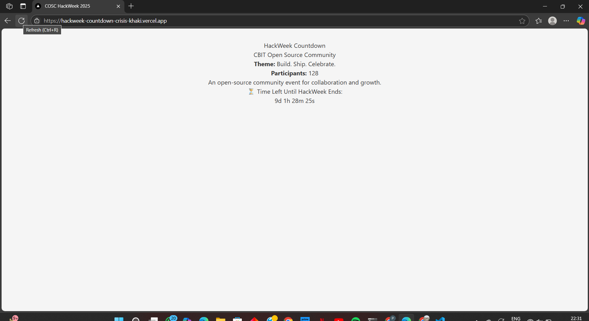

#  HackWeek Countdown Crisis

A responsive Next.js web app for HackWeek, showing COSC (CBIT Open Source Community) info from a local JSON file and a **live countdown timer** until HackWeek ends.

##  Fixes Made

- Fixed import errors and missing file structure
- Created and populated `cosc.json` with event info
- Rendered JSON data in `CommunityInfo.js`
- Built a real-time countdown timer component (`Countdown.js`)
- Ensured zero console warnings or errors
- Deployed successfully to Vercel

## Screenshot

## Live Site

[Click to Visit Deployed Site](https://hackweek-countdown-crisis-khaki.vercel.app/)

## Tech Stack

- Next.js 15 (App Router)
- React
- JavaScript
- JSON (local data)
